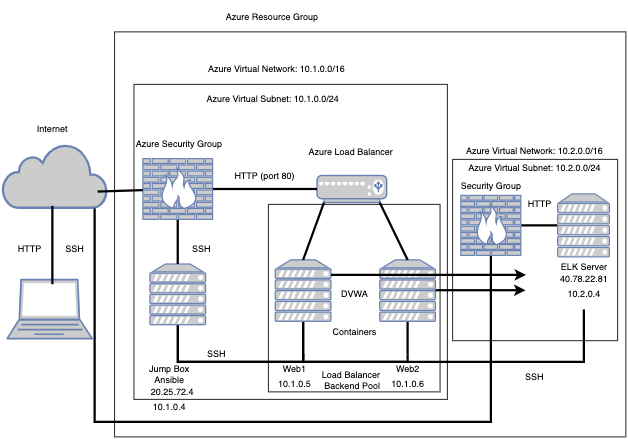

## Automated ELK Stack Deployment

The files in this repository were used to configure the network depicted below:



These files have been tested and used to generate a live ELK deployment on Azure. They can be used to either recreate the entire deployment pictured above. Alternatively, select portions of the respective playbook file may be used to install only certain pieces of it, such as Filebeat.

  - filebeat-config.yml
  - filebeat-playbook.yml
  - metricbeat-config.yml
  - metricbeat-playbook.yml

This document contains the following details:
- Description of the Topology
- Access Policies
- ELK Configuration
  - Beats in Use
  - Machines Being Monitored
- How to Use the Ansible Build


### Description of the Topology

The main purpose of this network is to expose a load-balanced and monitored instance of DVWA, the D*mn Vulnerable Web Application.

Load balancing ensures that the application will be highly available, in addition to restricting access to the network. The advantage of a jump box is that it provides one point of entry and exit, giving a choke point for configuring and securing the internal network from the external network (generic internet).

Integrating an ELK server allows users to easily monitor the vulnerable VMs for changes to the network and system configuration.

The configuration details of each machine may be found below.


| Name       | Function                  | IP Address | Operating System     |
|------------|---------------------------|------------|----------------------|
| Jump Box   | Gateway                   | 10.1.0.4   | Linux (ubuntu 18.04) |
| Web1       | Traffic Monitoring        | 10.1.0.5   | Linux (ubuntu 18.04) |
| Web2       | Traffic Monitoring        | 10.1.0.6   | Linux (ubuntu 18.04) |
| ELK Server | Data Aggregation          | 10.2.0.4   | Linux (ubuntu 18.04) |

### Access Policies

The machines on the internal network are not exposed to the public Internet. 

Only the Jump Box provisioner machine can accept connections from the Internet. Access to this machine is only allowed from the real-word, allowlisted public IP address from the administrator (`Red_Admin`) through SSH (`port 22`).

Machines within the network can only be accessed by the Jump Box provisioner machine and its corresponding ansible container with an IP address of `10.1.0.4`.

A summary of the access policies in place can be found in the table below.

| Name       | Publicly Accessible | Allowed IP Addresses    |
|------------|---------------------|-------------------------|
| Jump Box   | Yes                 | SSH from Allowlisted IP |
| Web 1      | No                  |                         |
| Web 2      | No                  |                         |
| ELK Server | Yes                 | SSH from Allowlisted IP |


### Elk Configuration

Ansible was used to automate configuration of the ELK machine. No configuration was performed manually, which is advantageous because this reduces deployment time per container, allows for scalable deployment, and eliminates manual configuration entry errors.

The playbook implements the following tasks by installing the following modules within the container:
- Install `docker.io`
- Install `pip3`
- Install `docker python module` 
- Configure `sysctl` modules
- Downloads and launches the docker ELK container
- Sets the docker services to boot on docker start

The following screenshot displays the result of running `sudo docker ps` after successfully configuring the ELK instance.


### Target Machines and Beats

This ELK server is configured to monitor the following machines:
- Web 1: `10.1.0.5`
- Web 2: `10.1.0.6`

We have installed the following Beats on these machines:
- `filebeat` version `7.6.2`
- `metricbeat` version `7.6.2`

These Beats allow us to collect the following information from each machine:
- filebeat allows us to collect data about the file system.
- metricbeat collects machine metris from your systems and services.

### Using the Playbook

In order to use the playbook, you will need to have an Ansible control node already configured. Assuming you have such a control node provisioned: 

SSH into the control node and follow the steps below:
- Copy the configuration file to the ansible container.
- Update the configuration files (`filebeat-config.yml` and `metricbeat-config.yml`) to include the IP address of the ELK Server (`10.2.0.4:5601` and `10.2.0.4:9200`)
- Run the playbooks (`filebeat-playbook.yml` and `metricbeat-playbook.yml`), and navigate to the ELK Server GUI via the ELK Server’s public IP address (`http://<ELK Server IP Address>:5601/app/kibana#/home`) to check that the installation worked as expected.

The two necessary playbook files, `filebeat-playbook.yml` and `metricbeat-playbook.yml`, must be copied to `/etc/ansible/roles`.
You will need to update `filebeat-config.yml` and `metricbeat-config.yml`, specifically on lines `1106` and `1806`, by adding the ELK server’s private IP address (`10.2.0.4`) in place of the default IP address provided in the configs, as shown below. This is necessary to ensure that the deployment of the Kibana monitor modules are deployed properly to the ELK server.

Line `1106`: Update the hosts’ IP address to your ELK servers’ private IP address:

```
hosts: [“10.2.0.4:9200”]
username: “elastic”
password: “changeme”
```

Line `1806`: Update the hosts’ IP address to your ELK servers’ private IP address:

```
setup.kibana:
  Host: “10.2.0.4:5601”
```
 
In addition to the above, you will also need to update the ansible container via the `/etc/ansible/hosts` file, specifying your specific targets, as shown below:

```
[webservers]
10.1.0.5 ansible_python_interpreter=/usr/bin/python3
10.1.0.6 ansible_python_interpreter=/usr/bin/python3

[elk]
10.2.0.4 ansible_python_interpreter=/usr/bin/python3
```

Finally, you’ll want to update the `username` within the `/etc/ansible/ansible.cfg` to match the username given to your Web 1 and Web 2 servers, as shown below:

`remote_user=sysadmin`
    
To check that your ELK server is running as expected, navigate to:
`http://<ELK Server IP Address>:5601/app/kibana#/home`

To download the playbook, update the files, etc., you will need to run the following:
```
ansible-playbook /etc/ansible/roles/filebeat-playbook.yml
ansible-playbook /etc/ansible/roles/metricbeat-playbook.yml
```
